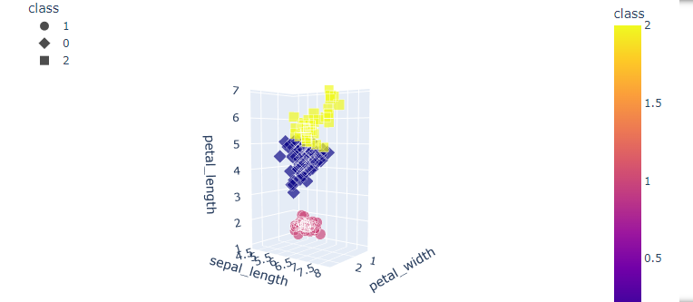
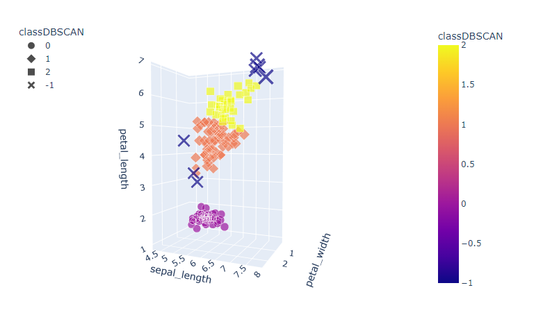

# K-Means_DBSCAN

## Cluster the IRIS dataset using both K-means and DBSCAN
Justify the k you choose using silohuette coefficient and the Elbow method:

- The K used in K-Means is the result where the decrease in inertia begins to slow in the elbow curve.
- The K in DBSCAN is the result of the highest value of the silhouette coefficients

How many clusters detect DBSCAN?
- 3

Which parameters did you use for DBSCAN?
- Just the eps and min_samples

Which algorithm better cluster the IRIS dataset and why?

- Both have favorable points, while the silhouette score in K-Means is a little bit lower compared with the socre in DBSCAN, both can detect 3 clusters, the difference is that the noise in DBSCAN detected 8 points that could be considered as outliers. In this case, the K-Means helps with the clustering a litte bit better but it is due to its nature since there are few variables.

To run the 3d Graphs just download the code and the libraries that are needed.

This is the image of the 3d graph for k-means:

This is the image of the 3d graph for DBSCAN:

## Apply PCA to the IRIS dataset.
Two principal components were selected since the first PCA contains 72.77% of the variance, and the
second 23.03%, givig an amount of 95.80% of the information. Adding an additional only provided
about 3% extra so it was discarded.

Make a 2D or 3D visualization of the transformed data.

Make a correlation matrix with both original variables and the generated principal components.

Explain the correlations you observe between both variable sets.
In the first one, it can be seen that some components are highly related on a positive or negative note.
Positive correlation indicates that if the value of the variable increases, the other increases as well and it will
be noticed on the correlated parameter. Negative correlation indicates the opposite. A correlation close to 1
shows a strong positive correlation, whereas close to –1 shows a strong negative correlation. In the
prediction of the class, sepal length and width are ones that have higher correlation to it, while petal length
and width have less correlation, but since there is a positive correlation it could affect the prediction.
In the second matrix, one can denote that there are two main dimentional vectors onto which one can
visualize the actual differences among the analyzed parameters, in such dimensions, one can distinguish

